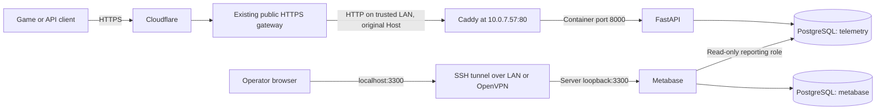

# Architecture and configuration

[Index](../README.md) · [Operations](operations.md) · [Recovery](recovery.md)

## Deployment inventory

Values established during the 6–7 October 2026 setup:

| Item | Value |
| --- | --- |
| Host | `10.0.7.57`, hostname `svrstanestanepo001` |
| OS at inspection | Ubuntu 26.04.1 LTS, x86-64 |
| Capacity | 4 logical CPUs, 7.2 GiB RAM, 4 GiB swap, approximately 98 GiB root filesystem |
| Deployment directory | `/opt/put-it-back/backend` |
| Compose project | `put-it-back` |
| SSH account | `stane`, with sudo |
| Public hostname | `putitback.vdsolution.com` |
| Public gateway | `109.245.246.253:443` |
| Reporting timezone | UTC |
| Schema marker | `public.schema_version`, row `1` |

The physical disk exceeds the root logical volume; this deployment did not resize
storage. Check actual capacity with `df -h /`, `free -h`, and
`sudo docker stats --no-stream`.

## Network and TLS



DNS resolves to Cloudflare addresses. The gateway was independently tested at
`109.245.246.253:443`, using the telemetry hostname for certificate validation. It
presented a valid Let's Encrypt certificate for `*.vdsolution.com`, expiring
**13 November 2026** at inspection. Renewal belongs to the existing gateway
administrator. This backend does not manage that gateway/certificate. Cloudflare's
account-level SSL mode and rules were not inspected directly.

Public TLS terminates upstream; the gateway delivers HTTP to Ubuntu with
`Host: putitback.vdsolution.com`. Configuration therefore separates the LAN listener
from the public URL:

```dotenv
TELEMETRY_HOST=http://putitback.vdsolution.com
PUBLIC_TELEMETRY_URL=https://putitback.vdsolution.com
BIND_IP=10.0.7.57
```

Do not enable another HTTPS redirect on the backend in this topology: redirecting
the gateway's HTTP requests to HTTPS creates a loop. Origin TLS is possible with a
coordinated gateway/certificate redesign; the current hop relies on the trusted LAN.
The gateway must preserve Host and keep public access on HTTPS. No DNS, Cloudflare,
router or gateway settings were changed during the backend deployment.

## Listeners and boundaries

| Service | Container port | Host exposure | Purpose |
| --- | --- | --- | --- |
| `proxy` | 80 | `10.0.7.57:80` | Gateway-facing Caddy |
| `api` | 8000 | None | Ingestion and API health |
| `db` | 5432 | None | Both databases |
| `metabase` | 3000 | `127.0.0.1:3300` | Dashboard via SSH |
| Host SSH | Not a container | Port 22 | LAN/VPN administration and dashboard tunnels |

Public-Host requests can reach `/`, `/health/live`, `/health/ready`, and
`/v1/events/batch`; other paths return 404. Requests addressed to `http://10.0.7.57`
only match health routes. Host matching is routing, not authentication: LAN callers
can send the public Host header but still need the ingestion key to upload.

Caddy adds `Cache-Control: no-store` and `X-Content-Type-Options: nosniff` on public
responses and removes its Server header; upstream proxies can add headers. The API
does not trust forwarded IP headers or implement per-IP rate limits. All Compose
services share a project network; there is no network per service.

## Runtime and persistence

| Service | Runtime/default image | Memory limit | Notes |
| --- | --- | --- | --- |
| API | Python 3.13 slim | 512 MiB | One Uvicorn worker; UID 10001; read-only root; tmpfs `/tmp`; dropped capabilities; no-new-privileges |
| DB | PostgreSQL 17 bookworm | 1,536 MiB | Durable named volume; 256 MiB shared memory |
| Proxy | Caddy 2 alpine | 256 MiB | Mounted Caddyfile, persistent Caddy volumes |
| Dashboard | Metabase | 2,304 MiB | JVM heap maximum 1,536 MiB |

All services use `restart: unless-stopped`; Docker starts at boot. An explicitly
stopped service may remain stopped across reboot. There are no CPU quotas,
replicas, broker, DB connection pool, aggregation worker or failover system.

Docker JSON logs rotate at 10 MiB/file, three files/service. DB health uses
`pg_isready`; API health queries its readiness endpoint. Host timers check Metabase
and public HTTPS. Named volumes are `put-it-back_pgdata`, `put-it-back_caddydata`,
and `put-it-back_caddyconfig`. The PostgreSQL volume contains **both databases**;
`backups/` is a separate host directory. Container recreation preserves volumes;
`docker compose down -v` deletes them and is not a routine restart.

Direct Python dependencies are pinned in [requirements.txt](../requirements.txt).
Deployed upstream image digests are recorded in `.env` by `pin_images.py`. Compose
defaults use tags, including Metabase `latest`; defaults are not the deployment
version record. Python's base image and transitive packages are not fully locked,
so future rebuilds can differ despite unchanged application source.

## Databases and permissions

| Role/database | Use and grants |
| --- | --- |
| `postgres` | Cluster administrator; schema management, maintenance, backup/restore |
| `telemetry_api` on `telemetry` | SELECT/INSERT on events; SELECT/INSERT/UPDATE on installations; no deletion/DDL grants |
| `analytics_reader` on `telemetry` | SELECT on analytics views; no raw-table SELECT grants; default read-only transactions; 30-second statement timeout |
| `metabase` on `metabase` | Owns application DB; Metabase manages its migrations |

Metabase stores users/questions/dashboards/settings in its own DB, and reads game
data using the separate reporting connection. Views read underlying tables with
their owner's privileges. `analytics.activity` exposes pseudonymous installation
IDs to the reporting role; read-only access is not anonymization.

`db-init.sh` creates roles/databases and applies `schema.sql` only on an **empty**
PostgreSQL data volume. `schema.sql` defines tables, indexes, views and grants; its
version marker is not an automated migration framework. Existing-column changes
need an explicit migration.

## Configuration reference

Server values live in root-only `/opt/put-it-back/backend/.env`.

| Variable | Used by | Meaning |
| --- | --- | --- |
| `POSTGRES_PASSWORD` | DB initialization | Administrator password |
| `API_DB_PASSWORD` | Initialization/API | telemetry_api password |
| `ANALYTICS_DB_PASSWORD` | Initialization/dashboard setup | Reporting connection password |
| `METABASE_DB_PASSWORD` | Initialization/Metabase | Application DB password |
| `METABASE_ENCRYPTION_KEY` | Metabase | Passed as MB_ENCRYPTION_SECRET_KEY; retain with its DB |
| `INGEST_KEY` | API/verification | Shared bearer token; API requires at least 32 characters |
| `BIND_IP` | Compose | Host port-80 address, default 10.0.7.57 |
| `TELEMETRY_HOST` | Caddy | Internal site address including http:// |
| `PUBLIC_TELEMETRY_URL` | Host scripts | Public HTTPS base URL |
| `POSTGRES_IMAGE`, `CADDY_IMAGE`, `METABASE_IMAGE` | Compose | Image references, normally deployed digests |

Compose assembles `DATABASE_URL` for the API. `TEST_ADMIN_DATABASE_URL` and
`TEST_READER_DATABASE_URL` are supplied only during testing. Metabase's DB variables,
UTC timezone, site URL `http://localhost:3300`, tracking and update-check settings
are in `compose.yaml`.

Use the generated `NAME=value` format: helpers parse it directly and `test.sh`
sources it as shell input. Arbitrary quoting, shell metacharacters or URL-reserved
password characters need corresponding parser/connection-URL changes. Bootstrap's
hexadecimal secrets avoid these issues. Shell environment overrides can supersede
file values. [Compose variable precedence](https://docs.docker.com/compose/how-tos/environment-variables/envvars-precedence/)

## Secrets and collection boundaries

`bootstrap.py` creates `.env` and `credentials.json` once, mode 0600, refusing to
regenerate an existing `.env`. The credential JSON is a convenience record, not the
authoritative Metabase user database. Update it after changing dashboard credentials.

On this PC, credentials/recovery archives are in ignored `verification/`, restricted
to the Windows user and administrators. `verification/server_known_hosts` pins the
SSH host key. On another PC, obtain and verify that key with the administrator;
do not disable checking merely because this ignored file is absent from a checkout.

The future APK's bearer token is extractable. There is no per-player authentication,
attestation, fraud detection or public admin API. Allowlisted fields do not prove
event honesty. The API stores no IP column and disables access logs. Cloudflare,
the gateway, SSH and Metabase may keep separate logs outside event-retention policy.

## Source map

| Files | Responsibility |
| --- | --- |
| `app.py` | Models, limits, throttling, inserts, acknowledgements, health |
| `schema.sql`, `db-init.sh` | Data model, reports, roles and initialization |
| `Dockerfile`, `requirements.txt`, `.dockerignore` | API build and exclusions |
| `compose.yaml`, `Caddyfile` | Services, exposure, volumes, routing |
| `bootstrap.py`, `pin_images.py` | Secrets and deployed image references |
| `setup_dashboard.py`, `verify_dashboard.py` | Production dashboard setup and verification |
| `qa-view.sql`, `setup_qa_dashboard.py` | Test-only reporting view migration, QA dashboard setup and verification |
| `test.sh`, `tests/test_ingestion.py` | Nine tests using a temporary DB |
| `verify_proxy.py` | Public upload smoke test with synthetic cleanup |
| `backup.sh`, `maintenance.sh` | Logical dumps and retention |
| `check_health.sh`, `put-it-back-*.service`, `put-it-back-*.timer` | Scheduled operations |
| `../tools/open-telemetry-dashboard.ps1` | Operator tunnel helper |
| `.gdignore` | Excludes backend from Godot resource scanning |

The source is authoritative. Update documentation with contract, schema, routing or
operational changes rather than allowing the original plan to imply new behavior.
