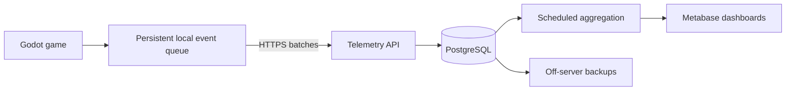

# Put It Back telemetry plan

Recorded: 2026-09-23.

Status (2026-10-07): backend foundation implemented in [backend/](../backend/README.md), deployed on Ubuntu `10.0.7.57` with public HTTPS at `https://putitback.vdsolution.com`. Godot 1.5.0 now implements optional collection, lifecycle/round/ad instrumentation and a durable offline queue. Actual Godot HTTPS upload and persisted duplicate replay passed. The [client guide](../backend/docs/client-integration.md) documents current behavior and build gating. Device release validation, continuous off-server backups and remaining KPI reports are follow-up work. The original proposal below remains the broader roadmap.

## Objective and assumptions

Measure whether players return, how much they play, which puzzles cause difficulty or disengagement, and how advertisements perform. The first dashboard should answer: **Do players return, and which puzzles make them stop?**

Assume an available server and an initial audience of hundreds to a few thousand daily players. Keep the game fully playable offline. Telemetry must never delay gameplay. Revisit capacity using measured event traffic, storage growth, and query performance.

## Architecture

Deploy these services using Docker Compose:

1. Caddy or Nginx for HTTPS and request forwarding.
2. A small FastAPI service exposing `POST /v1/events/batch`, with schema validation, payload limits, rate limits, and database writes.
3. PostgreSQL for installation records, raw events, and reporting tables.
4. A scheduled worker for daily activity, retention cohorts, session summaries, puzzle statistics, and revenue summaries.
5. Metabase for charts, filters, and SQL exploration. Give its analytics connection read-only access and use a separate application database for Metabase's settings.

Start with direct database ingestion and periodic aggregation. Add a message broker or specialized analytics database only when measured performance warrants it. Metabase recommends PostgreSQL for its production application database: [official documentation](https://www.metabase.com/docs/latest/installation-and-operation/configuring-application-database).

## KPIs and definitions

| Area | Metrics | Purpose |
| --- | --- | --- |
| Audience | Newly observed installations; daily, weekly, and monthly active installations | Audience growth |
| Retention | D1, D7, D30 return rates | Whether people return after trying the game |
| Engagement | Sessions per installation, active gameplay time, rounds per session | Depth of engagement |
| First experience | First launch → first round → first win → 10 rounds | Where new players stop |
| Puzzle difficulty | Win rate, solve time, timeouts, explicit abandonment, incorrect actions | Identify confusing mechanics or poor balance |
| Ads | Requests, load failures, impressions, ads per session, revenue | Delivery and monetization |
| Stability | Crashes, ANRs, startup time, slow frames | Technical quality |

Without accounts, player counts represent pseudonymous installations, not reliably distinct people. Reinstallation or another device can produce another identity. First observed launch is not a store-download count.

Define exact-day retention: D7 means active on the seventh calendar day after first launch, using one reporting timezone. Only cohorts old enough to reach that day enter its denominator. Keep definitions consistent across dashboards and document the chosen timezone and qualifying activity.

Separate foreground time from active gameplay, pauses, menus, and ads. Infer sessions from activity checkpoints; a proposed boundary is 30 minutes of inactivity. Do not rely on a final `session_ended` event because mobile apps can terminate without sending one.

Report practice separately from random play. Filter by app/build version, platform, level, puzzle revision, and acquisition cohort where available. Recent examples requiring separate puzzle revisions include bottle replacement versus bottle swapping and the increased horizontal alignment offsets.

## Client integration and event contract

Add one `Telemetry` autoload in Godot. Instrument existing lifecycle, round, input, and ad callbacks rather than duplicating game logic:

- `scripts/game.gd`: `start_round`, `finish`, foreground/background transitions, and gameplay timing.
- `scripts/puzzle_interaction.gd`: aggregate incorrect actions and rejected drops.
- `scripts/ads/android_ads.gd` and `scripts/ads/ad_manager.gd`: delivery, impressions, dismissals, and paid callbacks.

Godot can send JSON batches with HTTPRequest: [official documentation](https://docs.godotengine.org/en/stable/tutorials/networking/http_request_class.html).

| Event | Important fields |
| --- | --- |
| `first_open` | Installation ID, app version, platform |
| `session_started` | Session ID, entry point |
| `activity_checkpoint` | Foreground seconds, active gameplay seconds, last round |
| `round_started` | Round ID, level ID, practice/random mode, puzzle revision |
| `round_finished` | Win/timeout/explicit abandonment, active duration, action counts, starting fault count |
| `ad_requested`, `ad_loaded`, `ad_failed` | Ad attempt ID, placement, error category |
| `ad_impression`, `ad_closed` | Ad attempt ID, preceding round |
| `ad_revenue` | Ad attempt ID, value in micros, currency, precision |

Every event also carries a unique event ID, schema version, client timestamp, session sequence number, and build version. The server adds receipt time. Preserve event time separately from receipt time so offline uploads do not appear as fresh activity; define handling for invalid device clocks and late arrivals during implementation.

Count incorrect taps and rejected drops locally and include totals with round completion. Do not record every pointer movement for the initial dashboards.

Keep incomplete rounds distinct from known timeouts and explicit abandonment. A missing finish event alone does not prove a crash or abandonment.

## Reliable delivery

- Persist a bounded event queue on the device.
- Upload every 20–30 seconds or after a batch-size threshold, asynchronously.
- Retry temporary failures with increasing delays; remove events only after acknowledgement.
- Deduplicate by event ID on the server so retries cannot inflate metrics. Acknowledge only durably accepted data and define handling for individually invalid events.
- Keep gameplay independent of collection and network availability.
- Exclude development builds, automated tests, and test ads from production reporting.
- Queue revenue events immediately and attempt prompt delivery.
- Specify queue age/size limits and retention durations before rollout; these are not yet chosen.

## Ad revenue and acquisition

The vendored AdMob plugin already exposes `on_ad_impression` and `on_ad_paid`; the current game adapter does not yet record analytics from them. Wire these callbacks and retain their event identity so duplicate delivery cannot double-count money.

AdMob supplies impression revenue in micro units, its currency, and its precision. Preserve that precision and reconcile with provider reports. Set the paid callback before showing an ad and upload promptly: [AdMob documentation](https://developers.google.com/admob/android/impression-level-ad-revenue).

Calculate:

- ARPDAU: daily ad revenue divided by daily active installations.
- eCPM: revenue divided by impressions, multiplied by 1,000.
- D7/D30 cohort revenue: cumulative observed revenue per installation through those days.

Use a consistent currency basis for aggregates. These are observed revenue measures, not a prediction of total lifetime value. Cost per install and return on advertising spend additionally require acquisition attribution and advertising-cost imports.

The current game configuration uses test ads. Keep those out of production revenue reporting.

## Stability, privacy, and operations

Initially use Android vitals alongside gameplay dashboards for eligible Google Play installations. It provides crash and ANR reporting that ordinary gameplay events cannot replace: [Android vitals documentation](https://developer.android.com/topic/performance/vitals).

Use random installation IDs and minimize device information. Design collection controls, deletion, and retention before rollout. Do not assume ad-consent state automatically covers a separate analytics system.

Require authenticated dashboard access; keep PostgreSQL private. Enforce request-size/rate limits and allowlisted, bounded fields. Treat client data as untrusted: an API key embedded in an APK is extractable.

Add ingestion-error and disk-space monitoring, off-server backups, and restore tests. Monitor late events, rejected events, and duplicate events so dashboard changes can be distinguished from collection failures.

## Implementation stages

1. **Gameplay foundation:** event contract, persistent client queue, ingestion API, database migrations, and audience/retention/puzzle dashboards. Validate offline delivery, retries, deduplication, exclusions, and metric definitions using known synthetic sessions.
2. **Monetization and quality:** AdMob revenue and delivery reporting, Android vitals, reconciliation, and operational alerts.
3. **Experiments:** persistently assign variants and record exposure to measure changes such as offset size or ad frequency. Keep experiment assignment separate from game outcomes.

Before implementation, confirm the server OS/resources, domain and TLS setup, initial expected traffic, collection controls, retention policy, reporting timezone, and whether paid acquisition attribution is in scope.
